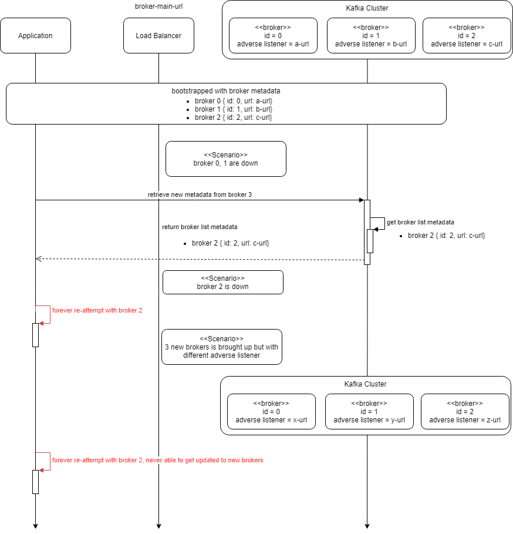

# Spring Boot Kafka Sample Project

### Exploring different type of consumers

#### Assign method

- no consumer group, hence, partition offset is managed from the application
- useful in the scenario where the application is only interested to observe the latest events when it is online
- E.g. of usecases
    - in memory application cache invalidation
    
### Kafka metadata limitation and workaround

- Kafka Client will only use the bootstrap server entry for initialization
- Upon kafka broker metadata update, it will not be referred anymore and fully relied on the metadata value, or the advertised listener.
- If the Kafka connection/advertised listener is not persist upon restarting (e.g. IP based), there will be issue if all kafka brokers are down. Even-though all the kafka brokers are back (with new IP) and can be connected via bootstrap server, the kafka client is not able to recover until an application restart.

#### Kafka metadata behaviour

#### Kafka failover

#### The workaround
- to register a broker detector to detect kafka connectivity and restart both consumer and producer client code